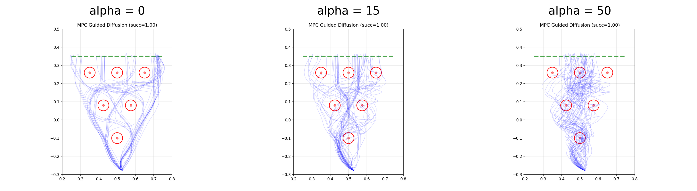
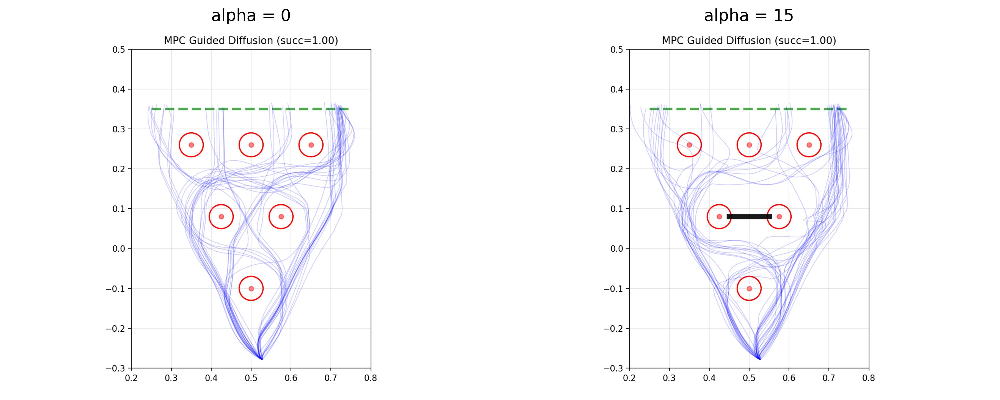

# D3IL Guided Diffusion Planning

Differentiable guided diffusion planning for robotic manipulation in D3IL, with a focus on the **Avoiding** task and an MJX/JAX-based differentiable rollout path for inference-time guidance.

---

## Overview

This repository is a research fork built on top of **D3IL**. The original D3IL codebase provides diffusion-policy training, simulation environments, and robot/control infrastructure. This project extends it in a specific direction:

- train or reuse a **diffusion policy** in the D3IL framework,
- run that policy in the **Avoiding** environment,
- replace the guidance-side rollout chain with a **JAX/MJX differentiable path**,
- compute rollout-based trajectory cost gradients during denoising,
- inject those gradients into reverse diffusion to obtain **guided diffusion planning**.

In short, the project adds a differentiable planning branch on top of D3IL’s policy/environment stack.

---

## Main Idea

This repository reorganizes the original research code into reusable modules so that other users can:

- load a pretrained diffusion policy,
- run a differentiable MJX rollout,
- define rollout-based costs,
- inject cost gradients into the denoising process,
- evaluate the planner in the Avoiding environment,
- visualize trajectories and denoising statistics.

The current version contains only the core guidance terms:

- **center-x cost**: keep the executed motion near the middle corridor,
- **barrier cost**: keep the executed motion away from the barrier.

---

## Guided diffusion planning algorithm

## Pseudocode

```text
Guided Diffusion Planning

Input:
  trained diffuser μθ
  differentiable simulator S
  cost function J(τ)
  guidance scale α
  covariances Σi

while not done:
    observe current state s
    initialize trajectory variable τ_N ~ N(0, I)

    for i = N, ..., 1:
        μ <- μθ(τ_i, s)                  # reverse diffusion step
        ξ <- S(τ_i; s)                   # rollout from current state
        J_val <- J(τ_i, ξ)               # rollout-based cost
        g <- ∇_τ J_val                   # gradient through rollout
        τ_{i-1} ~ N(μ - α Σ_i g Σ_i)     # guided sampling update

    execute a_0 <- τ_0^{a_0} in environment
```

### Interpretation

This repository uses **receding-horizon guided sampling**:

- denoise a short future plan,
- execute only the first part,
- observe again,
- replan at the next environment step.

---

## Repository structure

```text
.
├── agents/                  # trained or trainable diffusion 
├── avoiding/                # Avoiding task assets, plans, and related task-specific files
├── configs/                 # configuration files for training / simulation / evaluation
├── environments/            # environment definitions and wrappers
├── logs/                    # training and experiment logs
├── planning/
│   ├── guided_mpc/
│   │   ├── __init__.py
│   │   ├── agent_utils.py   # load/build diffusion agent for guided planning
│   │   ├── constants.py     # shared constants and task defaults
│   │   ├── costs.py         # center-x / smooth / barrier costs and configs
│   │   ├── planner.py       # guided diffusion planner
│   │   ├── plots.py         # plotting utilities for diagnostics and evaluation
│   │   └── simulator.py     # MJX differentiable rollout wrapper
│   └── scripts/
│       └── run_guided_avoiding.py   # main guided planning experiment script
├── plotting_results/        # generated figures and comparison plots
├── scripts/                 # utility scripts from training / evaluation pipeline
├── simulation/              # simulator-side code, including D3IL/MuJoCo/MJX-related components
├── run.py                   # main entry for standard training workflow
├── README.md
└── LICENSE
```

---

## Installation

Because this repository is based on D3IL and MuJoCo/JAX/MJX, dependencies depend on your machine setup.

A typical setup includes:

- Python 3.10 or 3.11
- PyTorch
- Hydra / OmegaConf
- NumPy
- Matplotlib
- MuJoCo
- JAX
- MJX

If the repository already contains an installation helper, start with:

```bash
conda env create -f d3il_diff.yml
conda activate d3il_diff
```

Then install any missing dependencies required by your GPU/CUDA/JAX environment.

### Recommended note

If you are using MJX on GPU, make sure your installed JAX build matches your CUDA version.

---

## Running guided diffusion planning

The main experiment entry is:

```bash
python planning/scripts/run_guided_avoiding.py
```

Depending on your local config style, you may also pass:

- checkpoint path,
- alpha / guidance strength,
- number of episodes,
- plotting/logging output directory,
- whether MJX guidance is enabled.

A typical experimental question is:

- how does performance change for `alpha`?

where:

- `alpha = 0` means no guidance,
- larger `alpha` means stronger rollout-gradient guidance.

---

## Results

Below are example result figures used in this project. In the repository, these are typically stored under `plotting_results/`.

### 1. Trajectory comparison under different guidance strengths using *center-x cost**



This figure compares rollouts for different `alpha` values.

Typical observation:

- `alpha=0`: trajectories obtained by diffusion model,
- moderate guidance: trajectories begin to concentrate,
- strong guidance: trajectories are pulled closer to the corridor center.

### 2. Trajectory comparison under different guidance strengths using *barrier cost**



This figure compares rollouts for different `alpha` values.

Typical observation:

- `alpha=0`: trajectories obtained by diffusion model,
- strong guidance: trajectories are pushed away from the barrier.

---


## Minimal usage workflow
### Step 1: Design or modify the cost function or weights

### Step 2: run guided planning on Avoiding

```bash
python planning/scripts/run_guided_avoiding.py
```

### Step 3: compare multiple guidance strengths

Run the same script with several values of `alpha`, for example:

- `alpha=0`
- `alpha=15`
- `alpha=50`

### Step 4: visualize and summarize

Save figures into `plotting_results/` and analyze the results.

---
